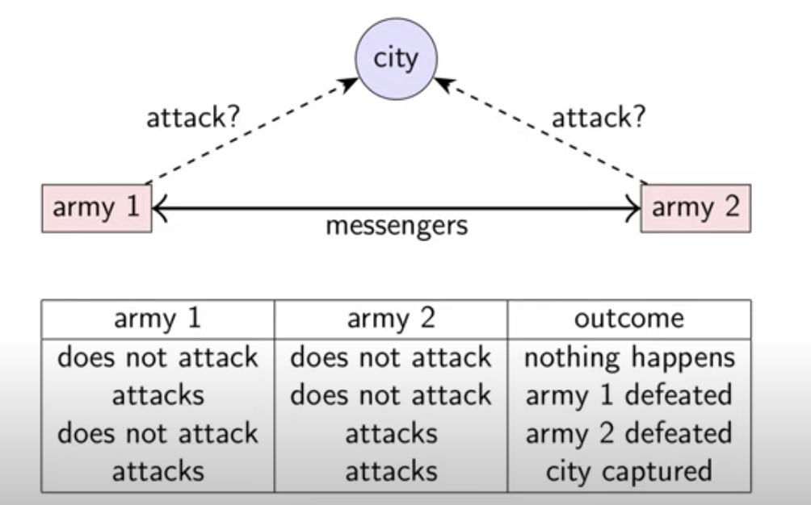

## 分布式系统模型
### two general problems: 网络模型

### 将军怎么制定策略

- 将军1 永远进攻， 即使没有收到回复
    - 尽可能多的派出送信员来增加将军2收到信的概率
    - 如果所有的送信员都被抓，将军2不知道进攻的事， 所以将军1失败
- 将军1 只有在收到将军2同意的情况下才发动进攻
    - 将军1 是安全的
    - 将军2 面临和将军1 在上一种情况同样的问题       
No common knowledge

### the Byzantine generals problems 拜占庭问题: 节点行为的模型

need 3f+1 generals in total to tolerate f malicious generals
证明：

#### 解决办法
假设
1. 少于1/3的将军是叛徒
2. 口头信息
3. 信息没有被加密

### 系统模型
1. 网络表现(eg.信息丢失)
    - 网络是不可靠的
2. 节点表现(eg.节点崩溃)
3. 时间表现(eg.延迟)
 
#### 网络表现
1. 可靠的连接
2. fair-loss link: 连接丢失，或者包重复
3. arbitrary links

#### 节点表现
每个节点执行一种被指定的算法
1. Crash-stop: 一个节点一旦故障, 它将永远停止
2. Crash-recovery: 一个节点在任何时刻都有可能崩溃， 保存在内存中的状态就会丢失，它可能在不久后恢复
3. Byzantine: 如果一个节点违法了相关算法，那它就是故障节点。故障节点可能有多种表现，崩溃或者向其他节点传递错误信息

#### 时机假设
1. Synchronous(同步): 信息延迟不会超过一定范围
节点以一个稳定的速度执行算法
2. Partically synchronous(部分同步): 系统有时是异步的有时是同步的
3. Asynchronous (异步): 信息是有延迟的,
节点可能会暂停执行, 没有时间保障

#### 违反同步机制
##### 网络导致的
1. 信息丢失需要重试
2. 拥塞和竞争导致的排队
3. 网络与路由的重新配置
##### 节点导致的
1. 操作系统调度问题
2. gc
3. 内存页 出错, 交换等

RTOS

## 故障容忍(Fault Tolerance)

#### 可用性(Availability)
服务等级目标Service-Level Objective (SLO)
服务水平协议 Service-Level Aggrement (SLA) 

#### HA高可用 (high availability)
1. Failure: 整个系统都不能正常工作
2. Fault: 系统的一部分不能工作
    - 节点故障
    - 网络故障

故障容忍: 系统作为一个整体能继续运行, 尽管有故障

SPOF (single point of failure): 节点或者网络故障导致failure

#### Failure detectors
1. Failure detector: 一种能探测其他节点是否出现故障的算法
2. Perfect failure detector: 标记一为一个故障节点当且仅当它崩溃的时候

 通常实现: 发一条信息,等待响应，响应超时就标记
 崩溃
问题: 不能区分是节点崩溃导致的还是暂时的网络不稳定导致的

#### Failure detection 在 部分同步系统中

Eventually perfect failure detector