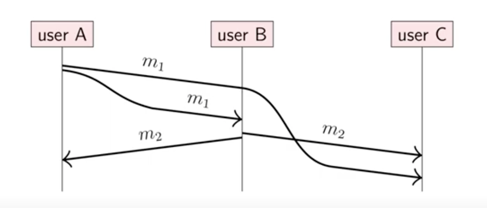
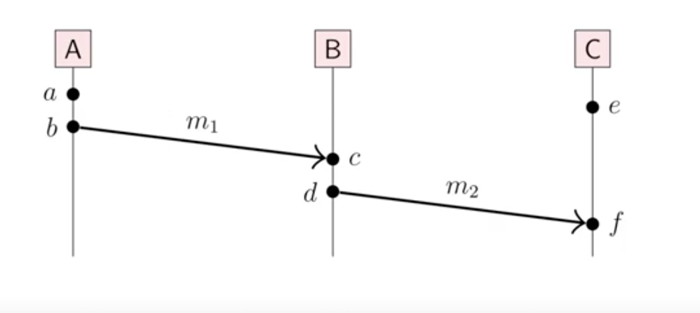

## Time, Clocks, and ordiing of events

#### 钟和时间在分布式系统中
分布式系统通常需要测量时间，
1. 调度器，超时，重试次数等
2. 性能衡量， 统计，概况
3. 日志文件，数据库，记录事件发生
4. 数据需要时间限制的验证(缓存 ttl)
5. 决定在几个节点中事件的顺序

区分时间的钟:
1. 物理钟: 计算流失了多少时间
2. 逻辑钟: 计算事件发生的数量或者消息发出去了多少

#### 信息的顺序

m1 = "A说: the moon is made of cheese"
m2 = "B说: oh no it isn't"

C 先接受到m2， 后接受到 m1

ordering of message using timestamps?

m1 = (t1, "A说: the moon is made of cheese")

m2 = (t2, "B说: oh no it isn't")

问题：即使同步了钟，但t2 < t1也是有可能发生的

#### the happens-before relation
一个事件定义为发生在一个节点(收发信息，或者在本地执行的过程中)
我们定义 a事件发生在b事件之前
1. a 和 b发生在同一个节点，且a的执行顺序在b之前
2. a事件 发送了几条消息m，事件b 是这几条消息的接受方
3. 存在事件c 满足 a->c 且 c->b

如果 既非 a->b 也非 b->a，这中情况下a和b就是并发(concurrent, a||b) 

##### example

- a->b, c->d, e->f 他们分别位于个自节点
- b->c , d->f 消息m1, m2 
- a->c, a->d, a->f, b->d, b->f, c->f 有传递性可得
- a||e, b||e, c||e, d|| e

#### 因果性
1. a->b , a 引发了b
2. a||b， a 不会引发b
