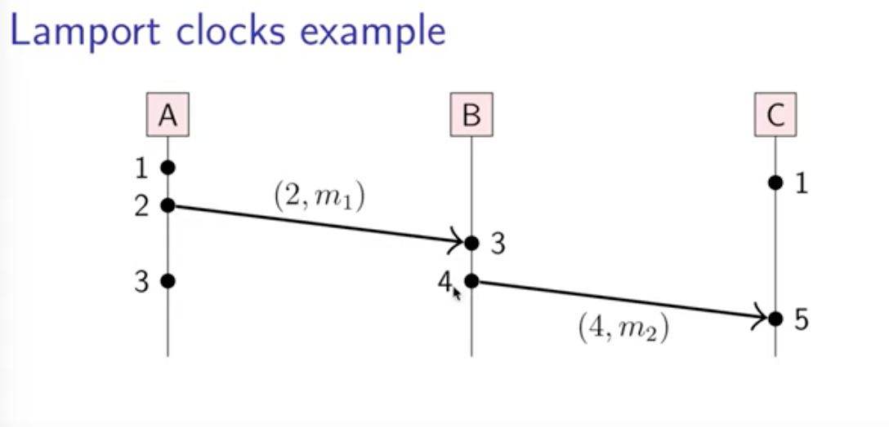
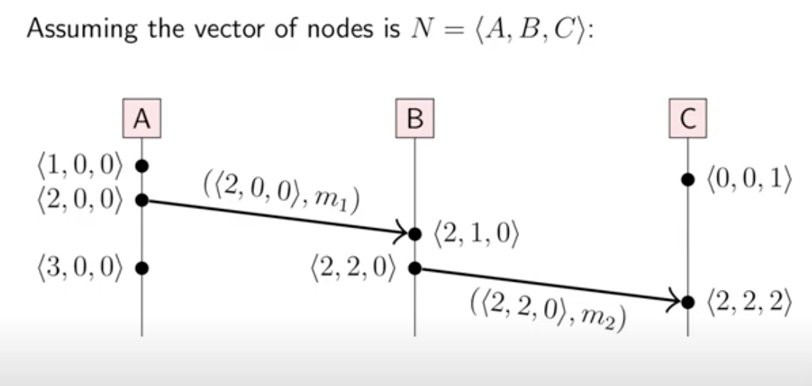
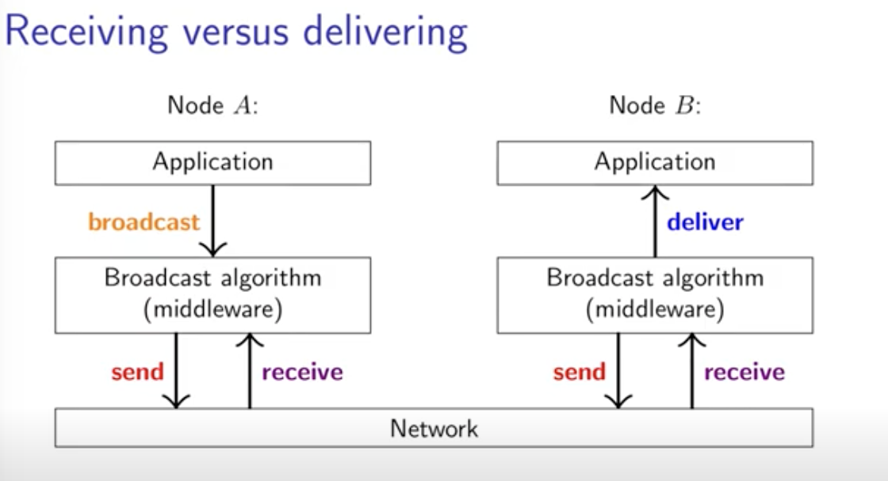
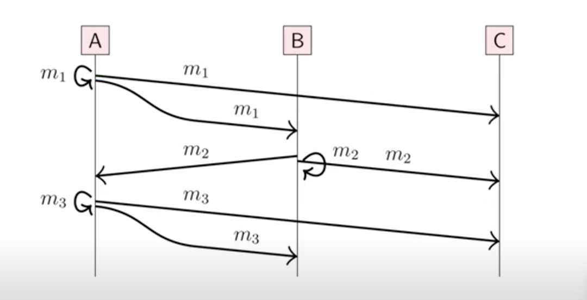
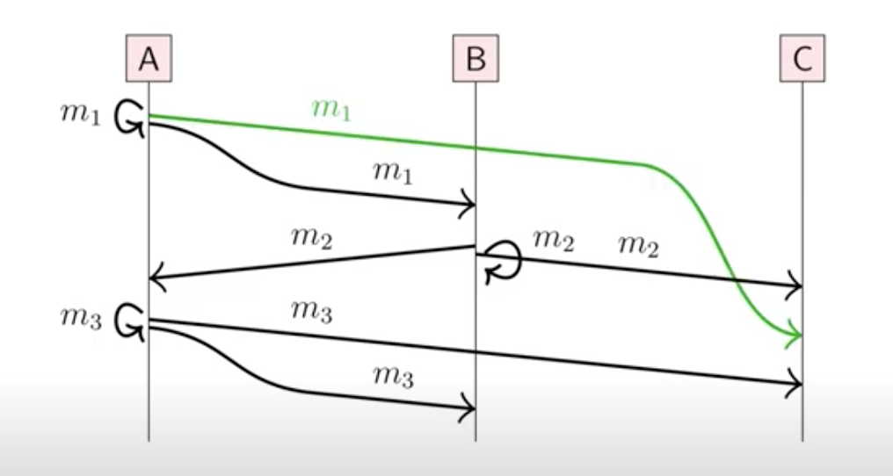
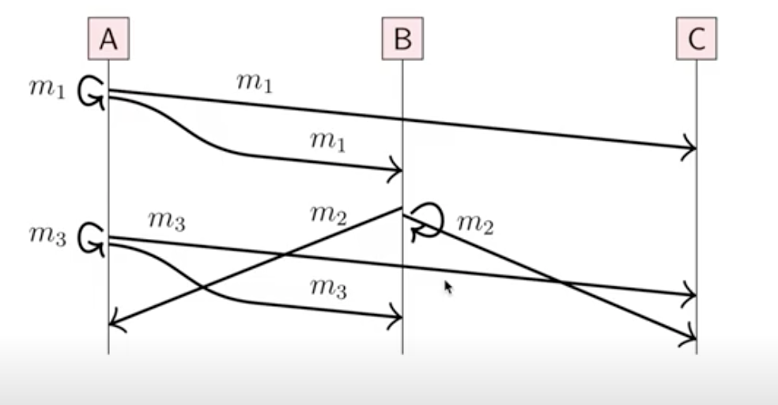
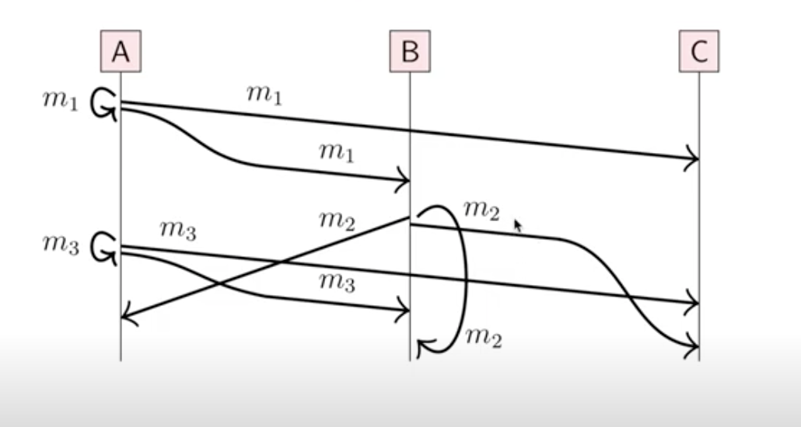
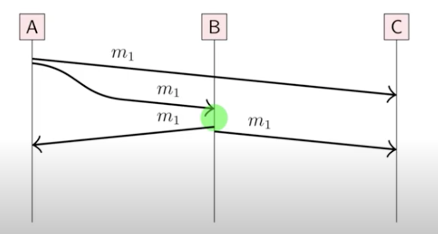

## 广播协议与逻辑时间

物理时间,对许多事情是有效的，但对因果关系可能出现不一致的情况

逻辑钟：用来捕捉因果依赖

(e1 -> e2) => (T(e1) < T(e2))

两种逻辑钟
- Lamport clocks
- Vector clocks

#### Lamport clocks 算法

初始化
t := 0 //每个节点都有它自己的t
end on

当每个节点有事件发生时
t := t + 1
end on

当请求发送出去时
t := t + 1; send (t, m) via the underlying network link
end on

接受消息时 (t0, m) via the underlying network link do
t := max(t, t0) + 1
deliver m to the application
end on

#### Lamport clocks 总结
- 每个节点都有自己的计数器t，在每次发生事件时更新
- L(e) 代表t增加后的值
- 发送消息时需附带附带本节点的t
- 收到消息时对比都到的t与本节点t'，更新t‘如果t>t'
- 如果 a->b 那么 L(a) < L(b)
- L(a) < L(b) 不能推出 a->b

#### Lamport example

利用 Lamport timestamps 定义总的顺序:
a < b <=> (L(a) < L(b) V (L(a) && N(a) < N(b)))

#### Vector clocks
- 假设有n个节点 N=<N1, N2, N3 ...>
- 事件的矢量时间 V(a) =<t1,t2,t3 ...>
- ti 表示在节点Ni观察到的事件数目
- 每个节点都有一个时间向量T
- 在每个节点增加向量T[i]

#### Vector clocks ordering
- T = T', iff T[i]=T[i]' for all i 属于 {1,..n}
- T <= T', iff T[i]<=T[i]' for all i 属于 {1,..n}
- T < T', iff T <= T' and T!=T'
- T||T', iff T !<= T' and T'!<=T

### 广播协议(Broadcast protocols)
- 一个节点发送消息，所有在组里节点都能收到
- 组里的成员可能是固定的也可能是动态的
- 一个节点发生故障，不会影响组里的其他节点

#### 广播的几种形式
1. FIFO: 如果m1和m2是同一个节点发出的广播信息,且broadcas(m1) -> broadcast(m2)，那么m1一定先于m2 发出
2. Causal: 如果 roadcas(m1) -> broadcast(m2)，那么m1一定先于m2 发出
3. 总顺序的广播: 如果在同一个节点钟m1先于m2发出，那么必须保证在所有节点中也是同样的顺序
4. FIFO-total order: 1和3

#### FIFO broadcast

#### Causal broadcast

#### Total-order broadcast

所有节点必须以同一顺序传递信息，这包括传递给自己的

#### 广播算法
1. 通过重复发送丢失的信息使广播机制变的可靠
2. 
广播节点向其他节点直接发送信息
- 依靠可靠的连接(重试+去重)
- 问题：节点可能在传递信息时崩溃

#### Eager reliable broadcast
第一个收到特别信息的节点，会向其他节点发送信息

可靠，但是时间复杂度叫大，O(n^2) for n 节点

#### 流行病协议 (Gossip protocols or Epidemic Protocol ) 
常被用在一个拥有很多节点的广播模型中
当第一节点接受到信息的第一时间便随机选择其他三个节点进行消息的推送

#### FIFO 广播算法
