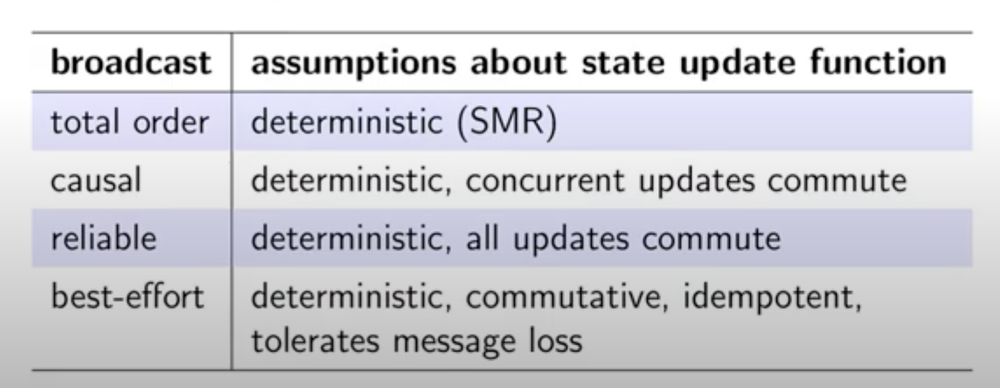

## Replication(复制)
- 在众多节点中保存一份相同的数据副本
- 应用场景: 数据库，文件系统，缓存。。。
- 一个节点保存有一份数据的就被叫做replica(副本)
- 如果某些replicas故障了或者需要重启等操作，还是能通过其他正常节点来访问数据，从而提高可用性
- 单节点无法满足多用户的需求，多节点加快高并发下的访问速度，伸缩可以接受读请求的机器数量(从而提高读取吞吐量)
- 对于不太变化的数据处理比较简单, 复制就行
- 重点关注那些经常变化的数据

RAID 用做单一节点的复制，应用场景nas

#### 领导者与追随者
存储数据副本的每个节点称为副本(replica)
- 副本之一被指定为leader，也称为主库。当客户端要想数据库写入时，必须将请求发送给leader，leader会将新数据写入本读存储
- 其他副本被称为followers(追随者)，从库，热备。当leader将新数据写入本地存储时，也会将数据变更发送给所有追随者，称为复制日志。
- 当客户端想要读取数据时，可以向领导者或追随者查询。但只有领导者才能接受写操作

#### 同步复制（synchronously）和异步复制 （asynchronously）

- 从库1 同步复制，从库和主库数据一致性，但如果同步从库没有响应，主库就无法处理写入操作

#### 状态更新重试

#### 幂等(Idempotence)
如果函数f(x)=f(f(x)),则函数f具有幂等性 
- 不具有幂等: f(likeCount) = likeCount + 1
- 具有幂等: f(likeSet) = likeSet ∪ {userID}

幂等性请求保证重试的时候不用去重

#### 重试的语义选择
- At-most-once: 发送请求，不重试，更新有可能不会发生
- At-least-once: 重试请求直到得到确认，有可能重复更新
- Exactly-once: 重试+幂等/去重

#### 添加和移除案例

f(likes) = likes ∪ {userID}
g(likes) = likes \ {userID}
幂等？f(f(x)) = f(x) 但是 f(g(f(x))) != g(f(x))

#### 添加和移除案例2

#### 解决办法
1. 对于每一次更新操作添加逻辑时间戳，并保存到数据库
2. 当删除记录的时候，只进行逻辑删除(tombstore)(标记为deleted)

3. reconciling relicas
relicas 周期性的进行互相通讯来检查数据是否不一致

##### 并发写的情况

- Last write wins (LWW) 造成数据丢失
- Multi-value register
如果t2 > t1, v2 代替 v1
如果t2||t1, 同时保存v1,v2 

## Quorums
replica 会因为网络或者节点故障导致不可用
假设 每一个replica出现故障而导致不可用的概率为P,并且对于每个replica的P是相互独立的

对于有n个replicas，至少有一个replica不可用的概率为
P(>=1 faulty) = 1 - (1-p)^n

#### 写之后读 一致性

向一个replica写，从另一个replica拿数据，客户端不能读取写进去的数据
如果要求同时向所有replica写然后读, 那只要有一个replica不可用，方案就不行
#### 解决办法

向B和C写入成功，再从A和B中读取根据时间戳选择v0还是v1

#### 读和写的Quorum
如果一个系统由n个replica组成
- 如果写操作被w个replica响应(write quorum)
- 并且从r个replica中读取（read quorum）
- r + w > n
- 那么就能保证读取到的值就是实际写入的值
- 写quorum和读quorum的共享的replica >= 1
- 通常情况下 n一般为奇数 3，5，7
- 写实例最多允许n-r个不可用，读的话为n-w

#### 读修复

## 状态机 replication
SMR
- FIFO-total order broadcast 每一次更新对所有replica生效
- replica 在每次更新完信息后发送回复：已更新状态
- 每一次更新都是确定的
- 每个replica都是一个状态机，从一个初始状态开始，以同样的顺序经历了一连串的状态转换，所有replica在最后都会变成相同的状态

#### 相近的idea
- 区块链， 分布式账本，智能合约

#### 数据库主从复制

从库在收到commit命令时记录事务

#### broadcast等级
