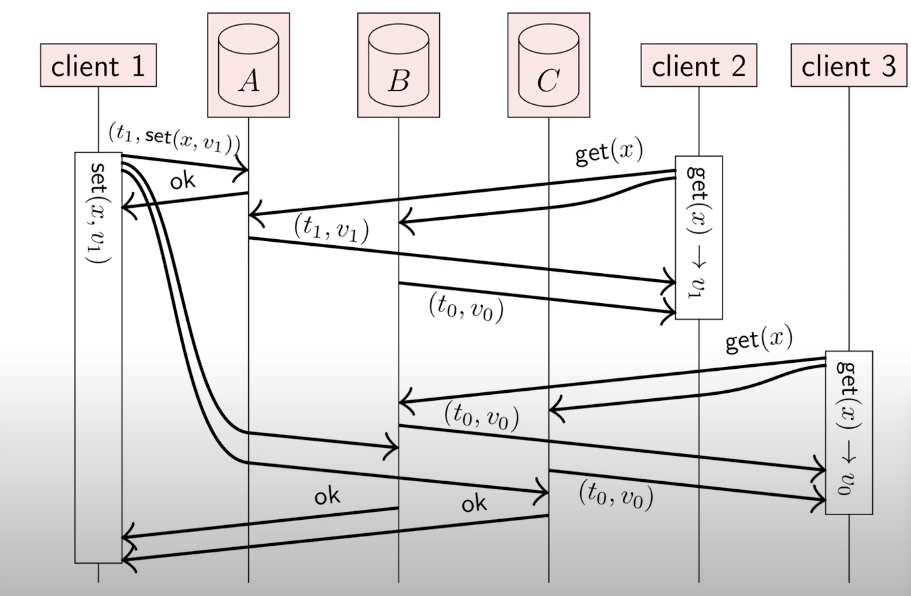
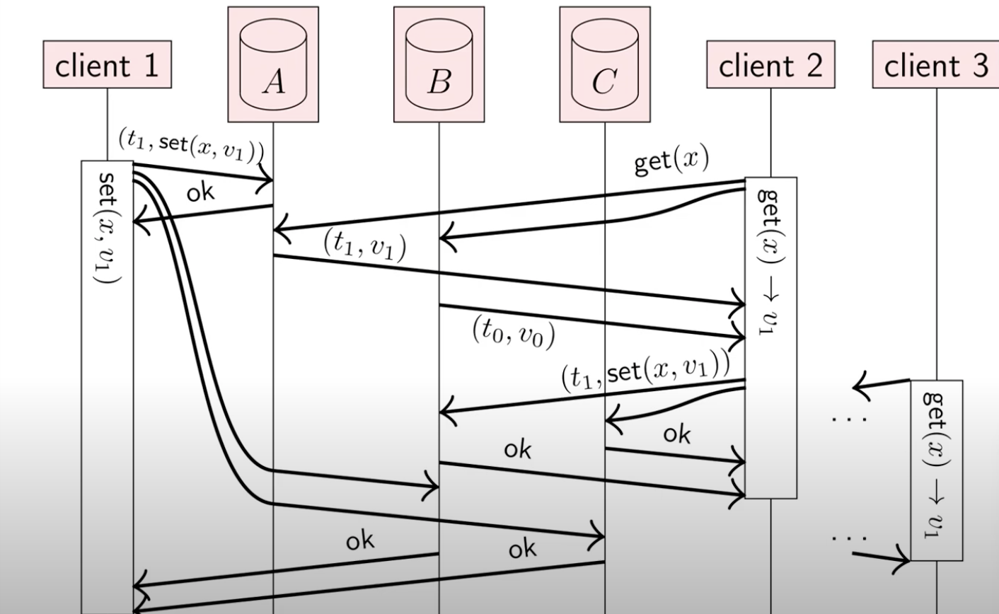
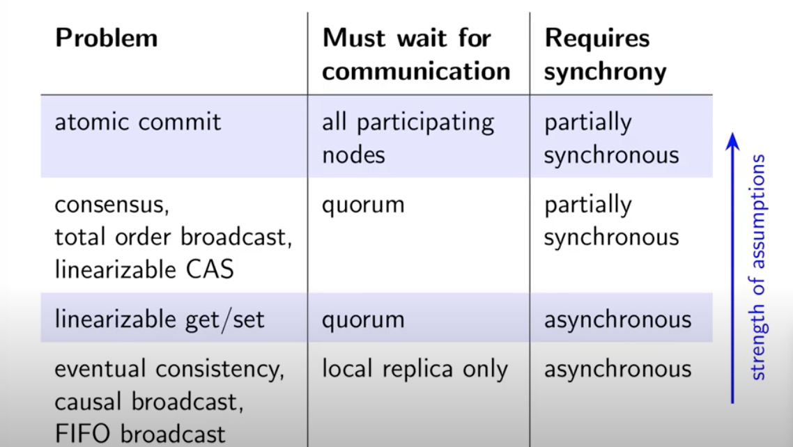

## 一致性（Consistency）
在复制延迟问题中，看到数据库复制中发生的一些时序问题，如果你在同一时刻查看两个数据库节点，则可能在两个节点上看到不同的数据

#### 线性一致性（linearizability）
也称为强一致性，原子一致性
在一个线性一致性的系统中，只要有一个客户端成功完成写操作，所有客户端从数据库，中读取数据必须能够看到刚刚写入的值。要维护数据的单个副本的假象，系统应保障读到的值是最近的、最新的，而不是来自陈旧的缓存或副本

针对的是不同的事物在不同的上下文环境中
- ACID: 数据库事物从一个一致的状态到另一个一致的状态
- Read-after-write consistency
- Replication: 各个replica应当保持一致
- 一致性模型

### 分布式事务
- 原子性： 一个事务要么被确认要么被取消
- 如果一个事务被确认了，它的更新是持久的
- 如果一个事务被取消，它应当不会产生影响
- 在多节点的情况下要么都确认，要么都取消
- 如果有一个节点崩溃了，那其他节点也必须取消这个事务

### 原子提交和一致性的区别
| consensus      | atomic commit |
| ----------- | ----------- |
| 一个或者多个节点发起提议      | 所有节点投票 是确认还是取消      |
|任何一个提议都是观点鲜明的     |如果所有节点都投确认，那就是确认，如果有一个节点投取消，那就取消这个事务  |
| 允许有若干节点出现故障，只要满足quorum就能继续工作|只要有一个参与的节点崩溃了那么该事务就要被取消 |

#### Two-phase commit(2PC)

##### coordinator崩溃
- coordinator 把决定写入磁盘
- coordinator 恢复后从磁盘读取数据然后发送给replica
- 如果在还没做决时就崩溃那么恢复后的决定即为 取消该事务
- 问题：如果在prepare 和做决定前 中间崩溃， 其他节点就不知道如何做决定，确认还是取消， 算法就被block住了直到coordinator恢复

### Linearizability线性一致性
多节点并发读写数据，如何定义一致性
- 每一个操作都是原子的
- 每一步操作返回最新的值， 强一致性

### No linearizable

违背了 linearizable 

### 最终一致性
线性一致性的优点
- 使得一个分布式系统看起来像一个非分布式
- 对于应用很简单
缺点
- 性能表现比较差：许多消息需要等待响应
- 可扩展性方面：leader可能成为一个瓶颈
- 可用性方面：如果不能与一个quorum有良好的网络通讯，就不能处理任务操作
最终一致性是一个比线性一致性弱的模型, 不一样的权衡

#### CAP theorem
- 一致性（consistency）
- Availablity
- Parition tolerance
一个系统要么是强一致性的，要么支持在partition中可用，而不能同事兼顾 需要做出选择

Partially avaiable design
#### 最终一致性
replica只根据他们本地的状态进行操作，如果不在有更新，最终所有的replica都会处于同一状态（无法保证需要话多少时间）
- 强的最终一致性
    - 每一个对正常节点的操作 最终会被同样正常的其他节点执行该操作
    - 任何2个replica进行相同的操作那么他们的最终状态也应该相同（即使执行的顺序不一样）
    - 特点：不需要等待网络通讯，因果广播能传播每一次更新，并发更新， 冲突需要被解决：merge algrithm

## 一致性总结

    

