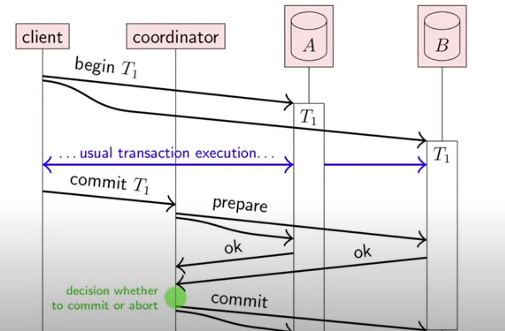

## Consistency
针对的是不同的事物在不同的上下文环境中
- ACID: 数据库事物从一个一致的状态到另一个一致的状态
- Read-after-write consistency
- Replication: 各个replica应当保持一致
- 一致性模型

### 分布式事务
- 原子性： 一个事务要么被确认要么被取消
- 如果一个事务被确认了，它的更新是持久的
- 如果一个事务被取消，它应当不会产生影响
- 在多节点的情况下要么都确认，要么都取消
- 如果有一个节点崩溃了，那其他节点也必须取消这个事务

### 原子提交和一致性的区别
| consensus      | atomic commit |
| ----------- | ----------- |
| 一个或者多个节点发起提议      | 所有节点投票 是确认还是取消      |
|任何一个提议都是观点鲜明的     |如果所有节点都投确认，那就是确认，如果有一个节点投取消，那就取消这个事务  |
| 允许有若干节点出现故障，只要满足quorum就能继续工作|只要有一个参与的节点崩溃了那么该事务就要被取消 |

#### Two-phase commit(2PC)

##### coordinator崩溃
- coordinator 把决定写入磁盘
- coordinator 恢复后从磁盘读取数据然后发送给replica
- 如果在还没做决时就崩溃那么恢复后的决定即为 取消该事务
- 问题：如果在prepare 和做决定前 中间崩溃， 其他节点就不知道如何做决定，确认还是取消， 算法就被block住了直到coordinator恢复

### Linearizability线性一致性
多节点并发读写数据，如何定义一致性
- 每一个操作都是原子的
