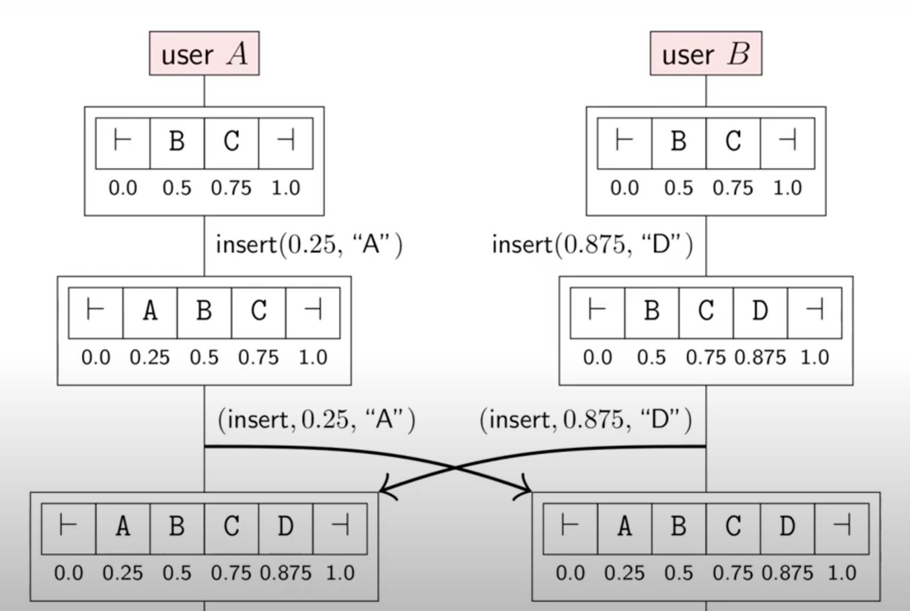

## 协作软件

### 应用中的并发控制
如今我们使用很多协作式的软件
- 语雀
- 多个用户或者设备在一个共享的文档或文件上进行操作
- 每个用户设备都有本地的数据备份
- 网络可用时随时都会更新本地的数据
- 挑战：如何协调并发的文档更新
- 算法
    - Conflict-free Replicated Data Types (CRDTs)
        - 根据操作
        - 根据状态
    - Operational Transformation (OT)

### 并发更新导致的冲突

### 协同文档更新导致的问题

### OT

### CRDT

